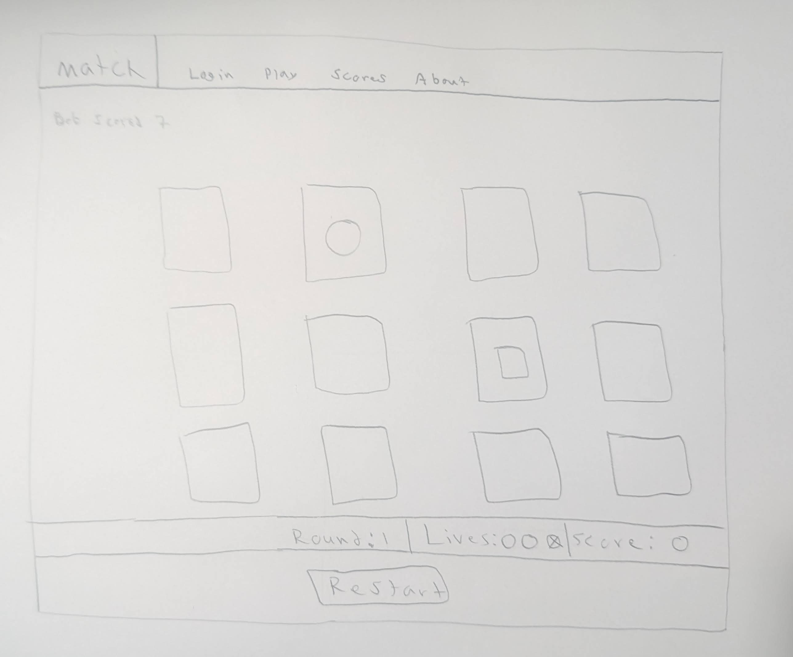

# Startup
Startup Application for BYU CS 260

## Specification Deliverable

### Elevator Pitch

Do you ever get bored standing in line, waiting for food at a restaurant, or even just relaxing at home? What if there was a way you could relieve your boredom, stretch your mind, and have fun, all while comparing your scores to friends in real time? Match that lets you re-enact the classic memory game from your childhood, allowing you to test your mental muscles by flipping cards two at a time until you get a match. Each successful match earns you one point. With just three incorrect guesses each round, how far can you get?  

### Design

### Key Features

- Secure login over HTTPS
- Ability to flip cards two at a time to look for a match
- Counter to keep track of round, lives, and score
- Scores from other players displayed in real time.
- High scores persistently stored

### Technologies:

I am going to use the required technologies in the following ways.

- **HTML** - Uses correct HTML structure for application. Four HTML pages. One each for login, playing the game, viewing high scores, and viewing information about the game. 
- **CSS** - Styling scales to different screen sizes and uses clean color choice and contrast.
- **JavaScript** - Provides login, game start button, and card flipping.
- **Service** - Functionality to save high scores
- **DB/Login** - Securely storing user data for login information and high scores in a database. Unable to play or view high scores unless authenticated. 
- **WebSocket** - As other players play the game and get a score, those scores are displayed to other players in the game.
- **React** - Application ported to use the React framework. 

 # HTML Deliverable:
For this deliverable I built out the structure of my application using HTML.

* HTML Pages: Four HTML pages that represent the ability to login, play, view scores, and view info about the game.
* Links: Each of the pages link to each other.
* Text: The about section contains text about the game
* 3rd Party Service Calls: Image on the about section will call an api to get an image.
* Images: There is an image located on the about page. Images of cards are also being used on the play page.
* Login: Name, password box, and login box are all represented on index.html.
* Database: scores page will pull scores from a database.
* Websocket placeholder: Live games and scores posted on the play page.

# CSS Deliverable:
For this deliverable I added styling elements to my application using CSS. 

* Header, footer, and main content body present
* Navigation elements: Dropped underlines and changed color for anchor elements.
* Responsive to window resizing: My app resizes appropriately to fit on various screen sizes and devices.
* Application elements: Uses good contrast and whitespace. 
* Application text content: consistent fonts
* Application images: Styling added to the about page image to have slight shadow around it. Also changed the base image. Styling also added to cards on play page using grid and card class from bootstrap.

# JavaScript Deliverable:
* Support for future login: When you hit login, your name and password are stored in local storage, you are taken to the play page, and the name is pulled from local storage and displayed as the current player. 
* Support for future database data: Local storage stores scores from the game, which is then loaded into the scores tab. 
* Support for future WebSocket: WebSocket placeholder for people finishing the game and logging a score in real time. 
* Support for Application Interaction Logic: Fully functional card flipping animation, restart button, random generation of cards, and card game implementation supporting lives, round, and score iteration.

# Service Deliverable:
* Node.js/Express HTTP service: done
* Static middleware for frontend: done
* Calls to third party endpoints: I call a random quote API on my about.html page using about.js
* Backend Service endpoints: There are two endpoints for updating the score and getting the score in index.js
* Frontend calls service endpoints: I use fetch in my saveScore function in play.js and in my loadScores function in scores.js

# Login Deliverable
* Supports new user registration: Creates a new account in the database when users create their account
* Supports existing user authentication: Checks for existing users, and if they are found in the database they are allowed access. Otherwise, an error message pops up. 
* Stores application data in MongoDB: Stores scores from users
* Stores and retrieves credentials in MongoDB: Done!
* Restricts application functionality based upon authentication: Users can still play the game and view the scores tab, but unless they are authenticated, their scores will not be saved and they cannot view the scores of others.

# WebSocket Deliverable
* Backend listens for WebSocket connection: done!
* Frontend makes WebSocket connection: done!
* Data sent over WebSocket connection: done!
* WebSocket Data displayed in application userface: when playing the game, WebSocket will display when other users connect, when they score, and when they start the game.

# React Deliverable
* Bundled using vite: done!
* Multiple functional react components: components for login, game, about, and scores all work
* React router: Router properly navigates between the login, game, scores, and about components
* React hooks: useState, useEffect, and useRef hooks are all used in several places throughout the application
